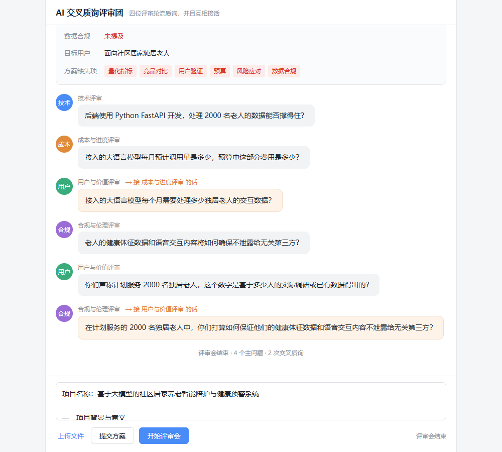

# AI 交叉质询评审团

> 面向高校学生方案的**答辩陪练与能力诊断系统**

学生提交自己的方案（毕设开题 / 大创 / 竞赛），4 位不同视角的 AI 评审轮流质询、**并且互相接话**，逼学生把方案想透，最后输出「你没答好的问题清单」。



> 聊天式的评审现场：每位评审一个气泡，**接话的气泡会标出「⟶ 接 XX 的话」**。
> 方案要素表作为一张卡片插在对话里，**缺失项用红字标出** —— 评审问的就是这些。

---

## 核心突破点

**让 AI 评审之间也互相质询。**

真实答辩现场最有杀伤力的，不是某个评委问了一个难题，而是**评委 B 接过评委 A 的话**：

> "我打断一下。技术评审建议用大模型做语义匹配，但按方案里写的 5000 用户量，光 API 成本每月就超预算三倍。"

本系统把这个行为做出来：评审发言后广播给其他评审，谁觉得碰到了自己的关注点就主动接话反驳。这是 **agent 与 agent 之间的对抗**，不是"四个 AI 各问各的"。

---

## 功能模块

| 模块 | 状态 | 说明 |
|---|---|---|
| **AI 模拟面试**（原有） | 可用 | 按课程从题库抽题、多轮问答、生成评价 |
| **AI 交叉质询评审团**（新增） | M1 / M2 已完成 | 方案上传 → 要素抽取 → 四位评审质询 |

四位评审的关注点互相排他：

| 评审 | 关注点 |
|---|---|
| 技术评审 | 可行性、是否过度设计、有没有更简单的方案 |
| 成本与进度评审 | 预算、接口调用费用、人力、周期是否现实 |
| 合规与伦理评审 | 数据来源合法性、隐私、授权、算法偏见 |
| 用户与价值评审 | 谁真的会用、相比现有方案的优势、是不是伪需求 |

---

## 目录结构

```
app/
  ai/
    agent/
      multi_agent/          # 原有：AI 模拟面试的 LangGraph 图
      review_agent/         # 新增：评审会的状态、schema、节点
    model/my_model.py       # 模型单例（本地 Ollama + 商业模型降级）
    prompt/
      review/               # 四位评审人设 + 要素抽取规则（yaml）
    tool/
      plan_parser.py        # Word / PDF / txt → 纯文本
      review_dao.py         # 评审会三张表的读写
  web/
    review_router/          # 评审会接口
    chat_router/            # 原有：聊天与流式接口
  html/                     # 前端页面（Vue2 CDN 单文件）
  main.py                   # 入口
data/                       # 测试方案样本
docs/                       # 选题方案与实测记录
scripts/                    # 建表 / 造素材 / 验收脚本
```

---

## 环境要求

| 项 | 要求 |
|---|---|
| Python | 3.12 |
| MySQL | 8.x，库名 `agent_project` |
| Ollama | 需拉取 `qwen2.5:7b`（`ollama pull qwen2.5:7b`） |
| 商业模型 | 阿里云 DashScope API Key（可选，本地模型失败时兜底） |

> **本地模型必须用 `qwen2.5:7b`，不要换 `qwen3.5:9b`。**
> 实测 9B 不可用：默认带思考导致正文返回空、不认 `response_format` 使结构化输出失败，且是否调用工具全凭模型自己决定，间歇性失败。详见 `docs/` 里的实测记录。

---

## 快速开始

### 1. 安装依赖

```bash
pip install -r requirements.txt
```

### 2. 配置环境变量

```bash
cp .env.example .env
```

然后编辑 `.env`，填入自己的 MySQL 密码、邮箱授权码、DashScope Key。
（`.env` 已被 `.gitignore` 忽略，不会被提交。）

### 3. 建数据库表

```bash
# 原有模块需要 question_bank / user_info 两张表
# 评审会模块的三张表由这个脚本创建，可重复执行
python scripts/init_review_db.py
```

### 4. 启动

**在项目根目录**执行：

```bash
python -m app.main
```

服务跑在 http://localhost:8000 ，接口文档在 http://localhost:8000/docs 。

| 页面 | 地址 |
|---|---|
| 模拟面试 | http://localhost:8000/ |
| **评审会** | http://localhost:8000/review |

> 注意：不要用 `python app/main.py`。那样 `sys.path` 会变成 `app/` 目录，
> `import app.xxx` 会失败。`main.py` 里的静态目录是相对项目根的 `app/html`，
> 所以必须从项目根启动。

---

## 接口

### 评审会（新增）

| 方法 | 路径 | 说明 |
|---|---|---|
| GET | `/review` | **评审会页面**（跳转到静态页） |
| POST | `/review/upload` | 上传 Word / PDF / txt，解析成纯文本（支持 multipart） |
| POST | `/review/submit` | 提交方案文本，抽取要素表并落库 |
| POST | `/review/meeting/stream` | **开评审会，SSE 推全过程**（结构化事件，带"谁接了谁的话"） |
| GET | `/review/session/{session_id}` | 读回一次评审会 |

### 原有

| 方法 | 路径 | 说明 |
|---|---|---|
| GET | `/` | 默认页面 |
| GET | `/chat` | SSE 流式对话与出题 |

---

## 验收脚本

| 脚本 | 验证内容 |
|---|---|
| `python scripts/check_m1.py` | 三种文档解析、上传接口、要素抽取、落库与读回、错误码、原有路由回归 |
| `python scripts/check_reviewers.py` | 四位评审出题，自动统计视角相似度、人设越界、一问多问 |
| `python scripts/check_m3.py` | 评审会调度、交叉质询、防跑偏上限、SSE 事件顺序 |
| `python scripts/check_page.py` | 页面路由、JS 语法、模板变量对账、前后端接口对账 |
| `python scripts/make_sample_docs.py` | 重新生成测试素材（Word / PDF） |
| `python scripts/make_requirements.py` | 按当前环境重新生成 requirements.txt |

验收脚本会在 `data/` 下写实测报告；`check_m1.py` 还会自动清理自己写进数据库的测试数据。

---

## 测试样本

`data/` 下有两份示例方案，**各自提供 txt / docx / pdf 三种格式**，可以直接拖到页面底部上传：

| 样本 | 说明 |
|---|---|
| `demo_plan.*` | 校园二手教材交易平台，信息写得比较全，基础样本 |
| `sample_plan_eldercare.*` | 社区居家养老系统，**技术 / 成本 / 合规 / 用户四个维度都留了破绽**，用来测评审效果 |

也可以指定样本单独跑四位评审：

```bash
python scripts/check_reviewers.py data/sample_plan_eldercare.txt
```

样本可以随时重新生成（Word 用 python-docx，PDF 用无头 Chrome 渲染，中文能正常嵌入）：

```bash
python scripts/make_sample_docs.py
```

---

## 进度

| 阶段 | 内容 | 状态 |
|---|---|---|
| M1 | 方案提交（文本 / Word / PDF）+ 要素抽取 + 三张表 | ✅ 已验收 |
| M2 | 4 位评审 persona + 顺序发言 + 视角去同质化 | ✅ 已验收 |
| M3 | **交叉质询**（评审互相接话）+ 防跑偏上限 + SSE + 前端页面 | ✅ 已验收 |
| M4 | 学生回答 + 追问（最多 2 层） | 待开发 |
| M5 | 会议纪要 + 未答好清单 + 四维雷达图 | 待开发 |
| M6 | 演示脚本固化 + 模型失败降级 | 待开发 |

---

## 已知事项

- **`question_bank` 表的数据需要自行准备**（题库），仓库里没有附带数据导出。
- `speaker_node` 目前只有两层降级（本地模型 → 商业模型），两个都不可用时会抛异常。计划在 M6 补上"预设质询模板"兜底。
- 记忆使用 LangGraph 的 `InMemorySaver`，重启后会话丢失；后续可换 PostgreSQL 持久化。
- 页面通过 CDN 加载 Vue，**断网会白屏**；现场演示前建议先把依赖本地化。
- 本地 `qwen2.5:7b` 能跑通全链路，但接话内容质量在多次运行之间波动明显；正式演示建议走商业模型。
