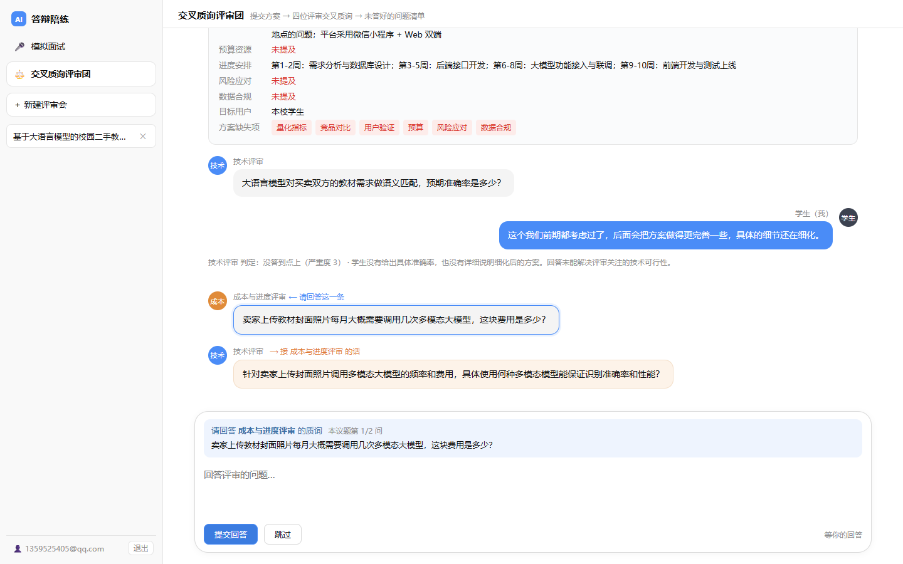

# AI 交叉质询评审团

> 面向高校学生方案的**答辩陪练与能力诊断系统**

学生提交自己的方案（毕设开题 / 大创 / 竞赛），4 位不同视角的 AI 评审轮流质询、**并且互相接话**，逼学生把方案想透，最后输出「你没答好的问题清单」。



> 登录后进主界面（ChatGPT 那种布局）：左边一条窄侧栏切换「模拟面试」／「交叉质询评审团」，
> 中间是消息流，底部是圆角输入框。
> 评审会里每位评审一个气泡，**接话的气泡会标出「⟶ 接 XX 的话」**；
> 方案要素表作为一张卡片插在对话里，**缺失项用红字标出** —— 评审问的就是这些。

---

## 核心突破点

**让 AI 评审之间也互相质询。**

真实答辩现场最有杀伤力的，不是某个评委问了一个难题，而是**评委 B 接过评委 A 的话**：

> "我打断一下。技术评审建议用大模型做语义匹配，但按方案里写的 5000 用户量，光 API 成本每月就超预算三倍。"

本系统把这个行为做出来：评审发言后广播给其他评审，谁觉得碰到了自己的关注点就主动接话反驳。这是 **agent 与 agent 之间的对抗**，不是"四个 AI 各问各的"。

---

## 功能模块

| 模块 | 状态 | 说明 |
|---|---|---|
| **AI 模拟面试**（原有） | 可用 | 按课程从题库抽题、多轮问答、生成评价 |
| **AI 交叉质询评审团**（新增） | M1 / M2 已完成 | 方案上传 → 要素抽取 → 四位评审质询 |

四位评审的关注点互相排他：

| 评审 | 关注点 |
|---|---|
| 技术评审 | 可行性、是否过度设计、有没有更简单的方案 |
| 成本与进度评审 | 预算、接口调用费用、人力、周期是否现实 |
| 合规与伦理评审 | 数据来源合法性、隐私、授权、算法偏见 |
| 用户与价值评审 | 谁真的会用、相比现有方案的优势、是不是伪需求 |

---

## 目录结构

```
app/
  ai/
    agent/
      multi_agent/          # 原有：AI 模拟面试的 LangGraph 图
      review_agent/         # 新增：评审会的状态、schema、节点
    model/my_model.py       # 模型单例（本地 Ollama + 商业模型降级）
    prompt/
      review/               # 四位评审人设 + 要素抽取规则（yaml）
    tool/
      plan_parser.py        # Word / PDF / txt → 纯文本
      review_dao.py         # 评审会两张表的读写
      email_tool.py         # 发登录验证码（SMTP，真发信）
  web/
    review_router/          # 评审会接口
    auth_router/            # 登录：发验证码 / 校验验证码
    chat_router/            # 原有：聊天与流式接口
  html/                     # 前端：login.html（登录）、app.html（单页，两个智能体共用一套外壳）
  main.py                   # 入口
data/                       # 测试方案样本
docs/                       # 选题方案、实测记录、评审会流程图
scripts/                    # 建表 / 造素材 / 验收脚本
```

---

## 环境要求

| 项 | 要求 |
|---|---|
| Python | 3.12 |
| MySQL | 8.x，库名 `agent_project` |
| Ollama | 需拉取 `qwen2.5:7b`（`ollama pull qwen2.5:7b`） |
| 商业模型 | 阿里云 DashScope API Key（可选，本地模型失败时兜底） |

> **本地模型必须用 `qwen2.5:7b`，不要换 `qwen3.5:9b`。**
> 实测 9B 不可用：默认带思考导致正文返回空、不认 `response_format` 使结构化输出失败，且是否调用工具全凭模型自己决定，间歇性失败。详见 `docs/` 里的实测记录。

---

## 快速开始

### 1. 安装依赖

```bash
pip install -r requirements.txt
```

### 2. 配置环境变量

```bash
cp .env.example .env
```

然后编辑 `.env`，填入自己的 MySQL 密码、邮箱授权码、DashScope Key。
（`.env` 已被 `.gitignore` 忽略，不会被提交。）

### 3. 建数据库表

```bash
# 原有模块需要 question_bank / user_info 两张表
# 评审会模块的两张表由这个脚本创建，可重复执行
python scripts/init_review_db.py
```

> **老库升级也走这个脚本。** `CREATE TABLE IF NOT EXISTS` 对已经建好的表什么都不做，
> 所以后面新加的列（比如 M5 的 `verdict_comment`）由脚本里那步增量迁移补上 —— MySQL 没有
> `ADD COLUMN IF NOT EXISTS`，它是先查 `information_schema` 再决定要不要 ALTER。
> 它顺带还会**删掉已废弃的 `review_score` 表**、清掉测试残留的孤儿记录。
> 拉完新代码先跑一次它，别直接启动服务。

### 4. 启动

**在项目根目录**执行：

```bash
python -m app.main
```

服务跑在 http://localhost:8000 ，接口文档在 http://localhost:8000/docs 。

**两个智能体现在是同一个页面里的两个界面**（左侧栏顶部切换），默认进模拟面试：

| 界面 | 地址 | 说明 |
|---|---|---|
| **登录页** | http://localhost:8000/login | 邮箱 + 验证码。`/` 和 `/review` 都先落到这里 |
| **模拟面试**（默认） | http://localhost:8000/ | 多轮问答，带四层记忆 |
| **交叉质询评审团** | http://localhost:8000/review | 同一个页面，带上 `?tab=review` 直接落到评审团 |

> **业务会话在登录成功那一刻就建好了**（原来是进聊天界面才建）：`/auth/login` 校验完验证码
> 直接调 `exam_agent.create_session(邮箱)`，`user_id` 用的就是邮箱本身 —— 所以题库、窗口记忆、
> 长期记忆、画像都跟着"你这个人"走，翻 Redis / Chroma 能一眼看出是谁。
> 主界面进页面时会拿这个会话回 `/create_session` 校验一次：万一放了一天过期了，
> 后端会另发一个新的，不会撞上"会话无效"。
> 侧栏底部的「👤 邮箱 ＋ 退出」可以退出登录；历史记录按账号分开存。
>
> 登录要**真的收得到邮件**（走 `.env` 里的 `EMAIL_HOST` / `EMAIL_FROM` / `EMAIL_PASSWORD`，
> QQ 邮箱那套就是填授权码），没有演示码兜底。验证码 5 分钟有效、60 秒才能重发一次、
> 同一个验证码只能用一次、连错 5 次作废。
>
> 页面是 ChatGPT 那种布局：左边一条窄侧栏（切智能体 + 历史记录），右边居中的消息流，
> 底部圆角输入框。历史记录存在浏览器 `localStorage` 里 —— 后端本来就按 `session_id`
> 记得上下文，所以刷新、关掉重开都能接回上一场；评审会开完的记录还能从库里读回来只读回看。
> **清掉浏览器数据 = 清掉侧栏列表**，但库里的评审记录和 Redis 里的会话记忆都还在。
>
> 侧栏每条记录右边有个 ✕（鼠标移上去才显形），点了会问一次再删。删的不是"侧栏那一行"：
> 这一场会话留在 Redis（会话记录／窗口记忆／会话锁）、PostgreSQL（摘要／图的检查点）、
> MySQL（评审会两张表）里的东西会一起清掉 —— 删完再拿这个 `session_id` 去
> `/create_session` 会拿到一个新会话，检查点没清的话它本来是能接着往下答的。
> 长期记忆和用户画像**按账号走、跨会话共用，不跟着删**（那是"清空这个学生"，不是"删掉这场会话"）。
>
> 评审会的**图结构、每个节点读什么状态写什么状态、分支条件、改哪里** →
> [`docs/评审团流程图与状态说明.md`](docs/评审团流程图与状态说明.md)（Mermaid，可直接编辑）
> ／ [`docs/评审团流程图.drawio`](docs/评审团流程图.drawio)（同内容的 draw.io 版，4 页，能拖拽改）

> 注意：不要用 `python app/main.py`。那样 `sys.path` 会变成 `app/` 目录，
> `import app.xxx` 会失败。`main.py` 里的静态目录是相对项目根的 `app/html`，
> 所以必须从项目根启动。

> 注意：Windows 上必须用 `python -m app.main` 这个入口。uvicorn 0.36 起不再读
> `asyncio` 的事件循环策略，它在 Windows 上默认挑 `ProactorEventLoop`，而 psycopg
> 的异步模式用不了它，会直接报 `Psycopg cannot use the 'ProactorEventLoop'`。
> `main.py` 里已经显式指定了 `loop="asyncio:SelectorEventLoop"`，换成命令行
> `uvicorn app.main:app` 时要自己补上 `--loop asyncio:SelectorEventLoop`。
> `python scripts/check_startup.py` 会在真正起服务这一层把这个坑验一遍。

---

## 接口

### 页面（登录后进同一个单页应用）

| 方法 | 路径 | 说明 |
|---|---|---|
| GET | `/` | 重定向到**登录页** `/static/login.html` |
| GET | `/login` | **登录页**（邮箱 + 验证码） |
| GET | `/review` | 也先落到登录页；登录后带 `?tab=review` 直接进评审团 |

### 登录

| 方法 | 路径 | 说明 |
|---|---|---|
| POST | `/auth/send_code` | 发 6 位验证码到邮箱（60 秒冷却；**发信失败不会把码留在服务端**） |
| POST | `/auth/login` | 校验验证码，成功返回 `{email, user_id, session_id}` —— **会话在那一刻就建好了** |

### 评审会

| 方法 | 路径 | 说明 |
|---|---|---|
| POST | `/review/upload` | 上传 Word / PDF / txt，解析成纯文本（支持 multipart） |
| POST | `/review/submit` | 提交方案文本，抽取要素表并落库 |
| POST | `/review/meeting/start` | **开评审会，SSE 推全过程**（结构化事件，带"谁接了谁的话"）；推到第一位评审提问就停 |
| POST | `/review/meeting/answer` | **学生交回答**，同一个 SSE；把会议从检查点唤醒，接着开到下一个提问或散会（`skip=true` 表示跳过） |
| GET | `/review/session/{session_id}` | 读回一次评审会：基本信息 + **会议纪要（质询记录时间线）** + **未答好的问题清单** |

### 模拟面试（原有）

| 方法 | 路径 | 说明 |
|---|---|---|
| POST | `/create_session` | 建会话 / 校验并复用已有会话 |
| GET | `/chat` | SSE 流式对话与出题（带 `session_id` 才接得上记忆） |
| DELETE | `/session/{session_id}` | **删除一场会话**（带 `?user_id=` 做归属校验）。面试留下的 Redis 会话记录／窗口记忆／会话锁、PostgreSQL 摘要与**图检查点**，以及评审会留下的 `review_session` + `review_question` 一起清；长期记忆／画像按 `user_id` 走，不动 |

---

## 验收脚本

| 脚本 | 验证内容 |
|---|---|
| `python scripts/check_startup.py` | **真起一次服务**（子进程 `python -m app.main`），16 项：事件循环、三个入口跳转、两个页面标记、会话复用与归属、登录（码错／码对／一次性／登录给的会话能接着用）、删会话（先给这场会造齐 Redis／摘要／检查点／评审记录的痕迹，删完逐样数一遍是不是真没了；删掉的会话回不来；别人的会话删不掉）—— TestClient 抓不到的那一层 |
| `python scripts/check_page.py` | 16 项：入口路由、标记齐全、旧页面确实删了、JS 语法（两个页面）、模板变量对账、前后端接口对账、登录贯通（登录页存会话 → 主页面没登录跳回 → 主页面接上会话）、侧栏删除会话（按钮 + `DELETE` + 归属者 + 二次确认）、气泡对齐不变式、Markdown 栅栏兜底（`stripFence` 的五个用例，带标记闭合／带标记未闭合／无标记整篇栅栏／真代码块不许动／普通 Markdown 不许动） |
| `python scripts/init_review_db.py` | 建评审会两张表 + 增量补列 + 清掉废弃表与测试残留 |

验收脚本会在 `data/` 下写报告。
`check_startup.py` 自己起的服务跑在 **8801**（`CHECK_PORT` 可改），所以演示的那个服务开着（8000）也能跑这份验收，不用先关；`app/main.py` 的端口也是 `PORT` 环境变量可覆盖的。
`check_startup.py` 里登录那几条**故意绕过发信**（验证码直接写进 Redis 再调接口）—— 验收不该往人邮箱里发东西。
**M1~M5 的实测数据都留在 `docs/选题方案` 里**，那些验证脚本按答辩需要精简掉了 —— 现场演示时人工走一遍流程即可。

---

## 测试样本

`data/` 下有两份示例方案，**各自提供 txt / docx / pdf 三种格式**，可以直接拖到页面里上传：

| 样本 | 说明 |
|---|---|
| `demo_plan.*` | 校园二手教材交易平台，信息写得比较全，基础样本 |
| `sample_plan_eldercare.*` | 社区居家养老系统，**技术 / 成本 / 合规 / 用户四个维度都留了破绽**，用来测评审效果 |

---

## 进度

| 阶段 | 内容 | 状态 |
|---|---|---|
| M1 | 方案提交（文本 / Word / PDF）+ 要素抽取 + 两张表 | ✅ 已验收 |
| M2 | 4 位评审 persona + 顺序发言 + 视角去同质化 | ✅ 已验收 |
| M3 | **交叉质询**（评审互相接话）+ 防跑偏上限 + SSE + 前端页面 | ✅ 已验收 |
| M4 | **学生回答 + 追问（最多 1 层）** + 跨请求续接（PostgreSQL 检查点） | ✅ 已验收 |
| M5 | **会议纪要（质询记录时间线）+ 未答好的问题清单**（落库可回看） | ✅ 已验收 |

---

## 已知事项

- **`question_bank` 表的数据需要自行准备**（题库），仓库里没有附带数据导出。
- 登录**没有演示码兜底**：`.env` 里的 `EMAIL_*` 配错就只会看到"发送失败"。现场演示前先自己发一封确认。
  验证码存在 Redis 里，**Redis 没起来时发码接口直接返回 503**（不会静默成功）。
- `speaker_node` 目前只有两层降级（本地模型 → 商业模型），两个都不可用时会抛异常。计划在 M6 补上"预设质询模板"兜底。
- 会议状态存在 PostgreSQL 检查点里，重启不丢。模拟面试的四层记忆（窗口 / 摘要 / 长期 / 画像）另有实现，评审模块**不用**它 —— 理由见方案第六之一节。
- **删除会话的归属校验只有面试那一半拦得住**：面试会话在 Redis 里有 `user_id`，删的时候能对一下；评审会的 `session_id` 是裸 hex、从来不进 Redis，`review_session.student_id` 目前也是空串，所以删评审会时没有归属信息可查（按幂等删除处理）。要补的话得在提交方案时把登录的 `user_id` 一起写进 `review_session`。
- 页面通过 CDN 加载 Vue，**断网会白屏**；现场演示前建议先把依赖本地化。
- 本地 `qwen2.5:7b` 能跑通全链路，但接话内容质量在多次运行之间波动明显；正式演示建议走商业模型。
