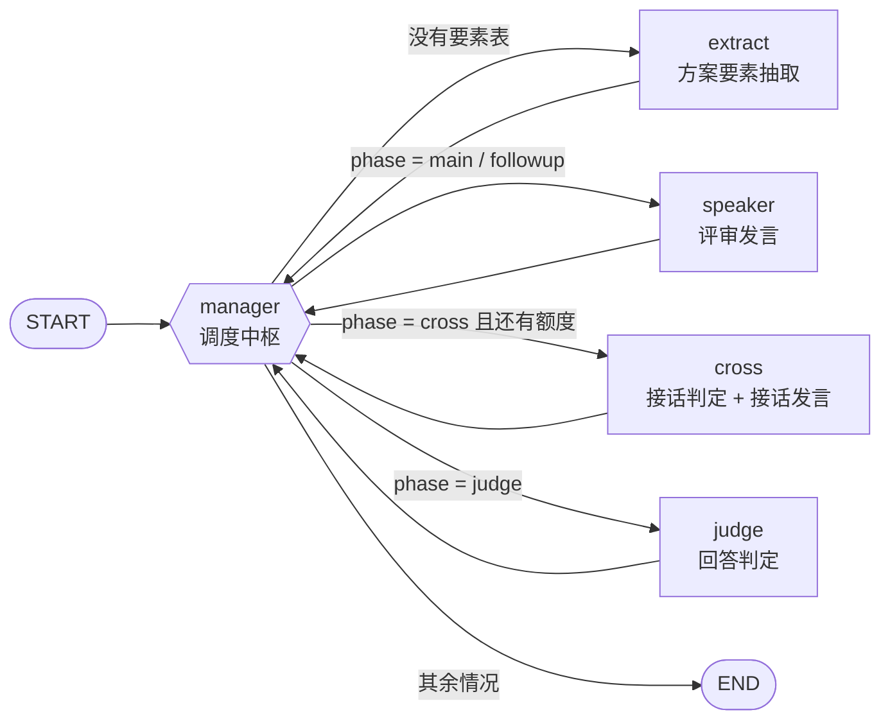
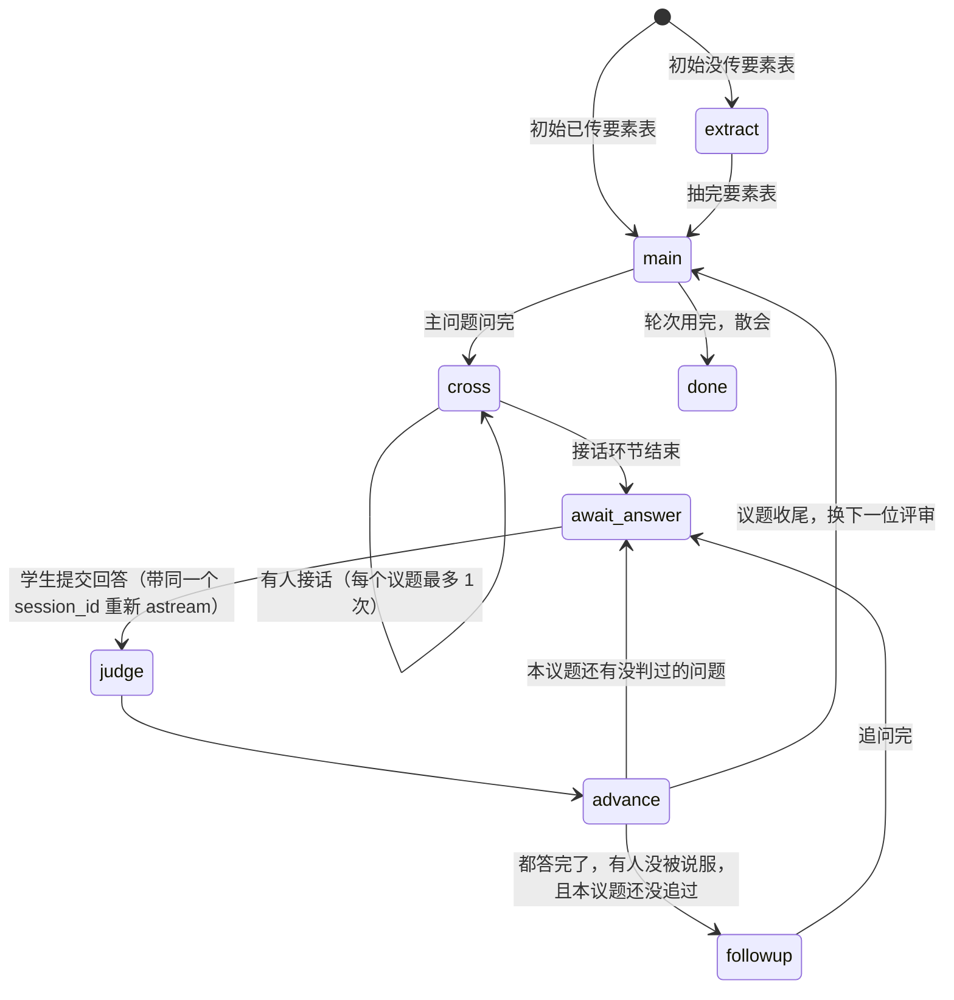
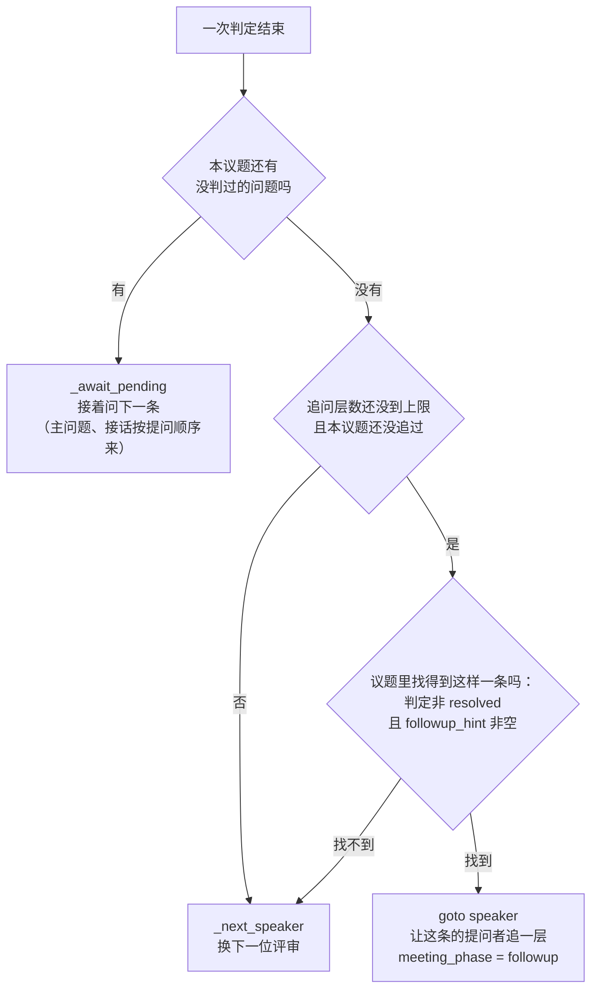

# AI 交叉质询评审团 · 流程图与状态说明

> **这份文档是给"后续要改它的人"看的**：图结构、每个节点读什么状态/写什么状态、分支条件分别是什么。
> 图和文字都是纯文本（[Mermaid](https://mermaid.js.org/)），用 Typora / VS Code / Gitee 都能直接渲染和修改。
>
> **想拖拽着改的话用这份**：[`评审团流程图.drawio`](评审团流程图.drawio) —— 同样内容的 draw.io 版本，
> 4 页（节点拓扑 / 会议状态机 / 判定后怎么走 / 一次问答走位），
> 用 [draw.io](https://app.diagrams.net/) 或 VS Code 的 Draw.io Integration 插件打开就能拖方框改。
>
> 代码对应关系：全部在 `app/ai/agent/review_agent/` 下
> —— `graph/review_graph.py`（图）、`state/review_state.py`（状态）、`node/*.py`（节点）、`events.py`（事件）

---

## 一、节点拓扑（LangGraph 层面）

和模拟面试图同一个骨架：**每个节点干完都回到 manager，由它决定下一步去哪**。
所以图本身很简单，真正复杂的是 manager 里那张决策表。



> `manager` 用的是 `Command(goto=...)` 动态跳转，不是静态的 conditional edge ——
> 所以 LangGraph 自带的 `draw_mermaid()` 画不出这些分支，只能手写（就是上面这张）。

**图会停在两种 `END` 上，含义完全不同：**

| 停在哪 | 含义 | 前端该做什么 |
|---|---|---|
| `meeting_phase = await_answer` | 图停住等学生回答，**这次请求正常结束** | 弹答题框，学生答完再发 `/meeting/answer` |
| `meeting_phase = done` | 会议真的开完了 | 展示会议纪要和未答好清单 |

---

## 二、`meeting_phase` 状态机（会议怎么往前走）



**`await_answer` 不是"挂起"，是 `goto=END`。**
LangGraph 没有挂起语义：图跑到 END 就结束了，状态存进**检查点**（PostgreSQL）。
学生答完再发一次请求，带同一个 `thread_id`（= `session_id`）重新 `astream`，
图从 START 进 manager，看到 `meeting_phase = judge` 就知道该去判定了 ——
和模拟面试续多轮是同一个套路。

---

## 三、manager 决策表（这是全篇最该看的部分）

`manager_node` 就是一张从上往下匹配的 if / elif 表。**改调度逻辑基本都在这里改。**

| 顺序 | 条件 | 去哪个节点 | 顺带写的状态 |
|---|---|---|---|
| 1 | `plan_elements` 为空 | `extract` | — |
| 2 | `phase ∈ {main, followup}` | `speaker` | — |
| 3 | `phase = cross` 且 `cross_checked = True` | `END`（`_await_pending`） | `await_answer` + `pending_*` |
| 4 | `phase = cross` 且 `cross_in_issue ≥ max_cross_per_issue` | `END`（`_await_pending`） | 同上 |
| 5 | `phase = cross` 且 `cross_total ≥ max_cross_total` | `END`（`_await_pending`） | 同上 |
| 6 | `phase = cross`（上面都不满足） | `cross` | — |
| 7 | `phase = judge` | `judge` | — |
| 8 | `phase = advance` | 看 `_route_after_judge`（见下） | — |
| 9 | `phase = await_answer` | `END`（防"不带回答就重新唤起"把会议跑飞） | — |
| 10 | `phase = done` | `END` | — |
| 11 | 其它（不认识的阶段） | `END` | `done`（不让会议卡死） |

### 8 号分支展开：`_route_after_judge`

判定完一条之后，要看着**整个议题**决定下一步，分三种：



### `_await_pending`：决定"学生现在答哪一条"

```
本议题（最后一条主问题往后那段）里，第一条还没判过的问题
    → pending_question = 它的 question
    → pending_type     = 它的 question_type
    → pending_from     = 它的 speaker_role
    → meeting_phase    = await_answer，goto=END
```

**这条规则是"一个议题多人提问"能讲通的关键**：学生按提问顺序一条一条答，
屏幕上永远只有一个"待你回答"，不会出现"三个人一起问我该答谁"。
兜底：万一一条都没找到（理论上不可能），直接 `_next_speaker`，不让会议卡住。

### `_next_speaker`：换人 / 换轮 / 散会

| 条件 | 动作 |
|---|---|
| `speaker_index + 1 < len(speaker_order)` | 换下一位，`speaker_index += 1`，`phase = main` |
| 本轮说完且 `round < max_round` | `round += 1`，回到第一位 |
| 都不满足 | `END`，`phase = done` |

**换人 / 换轮时会把 `_ISSUE_RESET` 里那 10 个字段一起清掉**（见第四节），
漏一个就会出现"新问题沿用上一题的标记"。

---

## 四、每个节点的输入 / 输出 / 副作用

### `extract` 方案要素抽取

| | 内容 |
|---|---|
| **读** | `plan_text` |
| **写** | `plan_elements`（结构化要素表）、`meeting_phase = main`、**`plan_text = ""`**（正文已经变成要素表，一份两万字的方案没必要每个超步都写进检查点） |
| **模型调用** | 1 次，`ProviderStrategy(schema=PlanElementsSchema)`；本地优先，失败降级商业模型，**两个都挂就返回兜底要素表**（会议照开） |
| **推事件** | `elements`（要素表正文，前端渲染成卡片） |
| **输入为空时** | `_degraded_elements()` 把已知缺失项列全，保证评审仍有东西可问 |

### `speaker` 评审发言（主问题 和 追问 共用这一个节点）

| | 内容 |
|---|---|
| **读** | `session_id`、`current_speaker`、`plan_elements`、`pending_type`（是不是 `followup`）、`followup_hint`、`question_index`（追问时按索引取本议题问答）、`spoke_in_issue`、`round`、`followup_depth` |
| **写** | `question_index +=`（新索引条目）、`pending_id`、`pending_question`、`pending_type`、`pending_from`、`spoke_in_issue +=`、`meeting_phase`、`cross_checked` |
| **落库** | `store.ask()`：插一条 `review_question`，拿回自增 `id` 当这条的索引键（**边开会边写透**，不再等散会整批写） |
| **`meeting_phase` 分支** | 主问题 → `cross`（先给别人接话机会）<br/>追问 → `await_answer`（不再接话，避免一个议题反复拉扯） |
| **模型调用** | 1 次，**内层 `astream(stream_mode="messages")` 流式**；本地优先，降级商业 |
| **推事件** | `speaker_start` → 多个 `token` → `speaker_end` |
| **兜底** | 模型没吐字 → 用一句通用追问顶上，不让会议卡死；`first_question()` 只保留第一个问句 |

> ⚠️ **改这个节点前先看**：一个节点里连续做两次模型调用时，
> 内层 `astream(stream_mode="messages")` 会一个 chunk 都收不到（实测 `iter=0`）——
> 这是 `cross_node` 改用 `ainvoke` 的原因。

### `cross` 接话判定 + 接话发言

| | 内容 |
|---|---|
| **读** | `session_id`、`plan_elements`、`question_index`、`spoke_in_issue`、`speaker_order`、`round`、`cross_in_issue`、`cross_total` |
| **写** | 有人接话时：`question_index +=`（`question_type = cross`，带 `target_speaker`）、`spoke_in_issue +=`、`cross_in_issue += 1`、`cross_total += 1`、`meeting_phase = cross`、`cross_checked = True`<br/>没人接话时：只写 `cross_checked = True` |
| **不改** | `pending_question` / `pending_type` / `pending_from`（那是 manager 从索引推的，这儿写了也会被覆盖） |
| **按需取正文** | 判定前 `store.rows_of(索引最后 6 条)` 拼"刚才的发言"；接话目标那句 `store.question_of(最后一条 main/followup)`；查炒冷饭 `store.all_rows(session_id)`（整场之前问过的每一句） |
| **模型调用** | **2 次**：① 一次调用拿到四位评审各自的接话意愿（`CrossSchema`）② 被选中的那位发言（`ainvoke`，一次性推给前端，不流式） |
| **推事件** | `speaker_start` → `token` → `speaker_end`（都带 `target` / `target_name`，前端据此画"⟶ 接 XX 的话"箭头） |
| **质量防线** | 接话内容和**整场之前问过的每一句**比语义相似度（本地向量余弦）：`≥ DEDUP_COS = 0.80` → **重试一次**，且把被重复的那句原话念给模型听；仍不合格就**放弃这次接话**（宁可少一次，也不要复述别人问过的话） |
| **兜底** | 判定失败 / 发言失败 → 当作"没人接话"，只写 `cross_checked = True`，会议继续；向量模型不可用 → 退回字面相似度（`DEDUP_BIGRAM = 0.7`，弱得多，见下） |

**怎么选人**（`pick_reaction`）：想接话 ∩ 本议题没发过言，按
① 严重度高 → ② 整场接话次数少 → ③ 名单顺序 排序取第一。

**炒冷饭这道防线是怎么定出来的**（数据见 `scripts/calibrate_dedup.py` 与
`data/_dedup_calibration.txt`，量的是 8 场真模型评审会、26 条真实接话）：

| 判据 | 线 | 挡掉 | 说明 |
|---|---|---|---|
| 字面 Jaccard（**换掉的那个**） | 0.70 | **1/26** | 26 条里字面相似度最高只有 0.593，唯一 1.000 的是跨议题逐字复述 —— 换个说法它就完全认不出来 |
| 向量余弦，只比"对方原话 + 自己问过的" | 0.80 | 10/26 | 漏掉上面那句逐字复述（它复述的不是对方、也不是自己，是**别的议题**里的问题） |
| 向量余弦，**比整场之前问过的每一句**（现在用的） | 0.80 | **13/26** | 口径：`store.all_rows(session_id)` 里所有非空问题，取余弦最高的一句 |
| 向量余弦，同口径 | 0.70 | 19/26 | **太低**：`#202`(0.856)、`#221`(0.767)、`#199`(0.779) 会被误杀 —— 那是"不同评审从各自角度追问同一主题"，正是交叉质询想要的效果 |

- 阈值扫描（最宽口径）：0.50→22、0.60→22、0.65→21、**0.70→19**、**0.80→13**、0.85→9、0.90→3。
- 想更狠还有一条路（**本版没启用**）：余弦粗筛 top-4 再交给重排序模型（`app/ai/utils/rerank_util.py`，
  `F:\models\bge-reranker-large_v1`）判一次，真重复的 logit ≥ 5、同主题 ≤ 0.4，线取 3.0 能拦下
  17/26 且一条不漏；实测一次检查约 0.3 秒。之所以没上：多一个 2GB 模型要现场加载（2.6 秒），
  而余弦已经够用。要换过去，改 `cross_node._repeated_question` 一处即可。
- **向量模型不可用时的兜底**：退回字面 Jaccard（`DEDUP_BIGRAM = 0.7`），只拦得住逐字复述。
  这条路径由 `scripts/check_dedup.py` 单独验（含反向验证）。
- **真模型上的实测**：加完这道线后跑预跑（`scripts/dry_run_demo.py`，会话 `dryrun-7584343d9a`，7 问 / 2 接话 / 1 追问），
  日志里出现两次拦截：成本评审想接话时又问了"每月调用量"这类已问过的角度 → **重试一次仍在炒冷饭 → 放弃这次接话**，
  这一议题改由技术评审接（`#267`，角度是"准确率提升多少、撑不撑得住"，与成本那问不同）→ 会议照常往下走。

### `judge` 回答判定

| | 内容 |
|---|---|
| **读** | `pending_from`（谁问的）、`pending_id`（**这次回答对应哪一条**）、`pending_question`、`student_answer`、`plan_elements`、`question_index` |
| **写** | 判定结果 `verdict` / `severity` / `followup_hint` **写回索引里对应那条**（manager 要靠它决定追不追）、`meeting_phase = advance`、`student_answer = ""` |
| **落库** | `store.save_verdict(entry["id"], ...)` 把回答、判定、评语写回那条记录，然后 `entry.pop("question")` —— 答完的问题原文不再占状态 |
| **模型调用** | 1 次（`JudgeSchema`）；**学生跳过 / 没答时走短路，不调模型**，直接判 `unresolved` + 严重度 3 + 追问方向留空 |
| **推事件** | `verdict`（判定结果、严重度、理由） |
| **兜底** | 判定失败 → 按 `unresolved` 处理但不追问；模型给了 `resolved/partial/unresolved` 之外的值 → 一律当 `unresolved`；`severity` 夹到 1~5 |
| **只判定，不决定路由** | "还有没有没答的""要不要追"交给 manager —— 那要看整个议题，单个判定决定不了 |

**清单口径**（`collect_unresolved`）：一个议题里每位评审只问一次（主问题或接话），
**追问是这个人的第二次**，所以按 `speaker_role` 归拢、以**最后一次判定**为准：

- 追问答好了 → 这个问题从清单里消失
- 追了还是没答好 → 进清单，严重度取两次里更高的
- 清单里显示这位评审**最先问的那条**，追问单独附在后面（学生看到的是"我被问的是什么"，不被打断思路搞晕）

---

## 五、状态字段字典（`ReviewState`）

> ⚠️ **LangGraph 只会保留 `ReviewState` 里声明过的字段。**
> 节点里 `return` 一个没声明的字段会被**静默丢掉**，不报错。
> 这是 M3 踩过的坑：传 `max_cross_total=0` 想关接话，结果出现了 7 次接话。
> **要加新状态，先加到 `state/review_state.py`。**

### 方案类

| 字段 | 类型 | 谁写 | 谁读 | 什么时候清 |
|---|---|---|---|---|
| `plan_title` | str | 初始化 | 落库 | — |
| `plan_text` | str | 初始化 | `extract` | **`extract` 抽完要素就清空**（正文变成要素表之后没必要再占状态） |
| `plan_elements` | dict | `extract`（或初始化时直接复用提交阶段的结果） | `speaker` / `cross` / `judge` | — |

### 会议控制类

| 字段 | 类型 | 谁写 | 谁读 | 什么时候清 |
|---|---|---|---|---|
| `meeting_phase` | str | manager / speaker / judge / extract | manager（唯一开关） | — |
| `round` | int | 初始化 / `_next_speaker` | `_next_speaker`、写记录 | — |
| `speaker_order` | list[str] | 初始化（默认 `[tech, cost, compliance, user]`） | `_next_speaker`、`cross` | — |
| `speaker_index` | int | `_next_speaker` | `_next_speaker` | — |
| `max_round` | int | 初始化（前端传，默认 1） | `_next_speaker` | — |

### 当前议题类

| 字段 | 类型 | 谁写 | 谁读 | 什么时候清 |
|---|---|---|---|---|
| `current_speaker` | str | `_next_speaker` / `_route_after_judge` | `speaker` | 换议题时重设 |
| `pending_question` | str | `_await_pending`（`speaker` 也写，随后被覆盖） | `judge`、`_tail` | **换议题时清空** |
| `pending_type` | str | `_await_pending` / `_next_speaker` / `_route_after_judge`<br/>取值 `main` / `cross` / `followup` / `""` | `speaker`（判断是不是追问）、`_tail` | **换议题时清空** |
| `pending_from` | str | `_await_pending`（提问者角色） | `judge`（谁判、谁追） | **换议题时清空** |
| `pending_id` | int | `_await_pending`（库里那条记录的 id） | `judge`（按它精确定位这次要判哪一条） | **换议题时归零** |
| `followup_depth` | int | `_route_after_judge`（+1） | `_route_after_judge`（封顶判断） | **换议题时归零** |
| `followup_hint` | str | `_route_after_judge`（从索引里取） | `speaker`（追问时作提示） | **换议题时清空** |
| `student_answer` | str | 前端经 `/meeting/answer` 传进来 | `judge` | `judge` 用完清空 / 换议题时清空 |

### 防跑偏类

| 字段 | 类型 | 谁写 | 谁读 | 什么时候清 |
|---|---|---|---|---|
| `cross_in_issue` | int | `cross`（+1） | manager 第 4 条 | **换议题时归零** |
| `cross_total` | int | `cross`（+1） | manager 第 5 条 | 全场不清 |
| `spoke_in_issue` | list[str] | `speaker` / `cross`（append） | `cross` 选人时排除 | **换议题时清空** |
| `cross_checked` | bool | `speaker`（主问题 False / 追问 True）、`cross`（True） | manager 第 3 条 | **换议题时归零** |
| `max_cross_per_issue` | int | 可按场次覆盖 | manager 第 4 条 | — |
| `max_cross_total` | int | 初始化时可选覆盖（传 0 能关掉接话） | manager 第 5 条 | — |

> **`_ISSUE_RESET` 一次清 10 个字段**：`cross_in_issue`、`cross_checked`、`spoke_in_issue`、
> `pending_type`、`pending_question`、`pending_from`、`pending_id`、`followup_depth`、`followup_hint`、`student_answer`。
> 加新字段时记得一起加进去。

### 产出类

| 字段 | 类型 | 谁写 | 谁读 | 说明 |
|---|---|---|---|---|
| `session_id` | str | `ReviewGraph.start` | `store` 的每一次读写 | 会话的键：状态里只留它，正文靠它 + `id` 对回 MySQL |
| `question_index` | list[dict] | `speaker` / `cross`（append）、`judge`（回填判定） | manager 全部决策、`judge` 定位、`_tail` 报题号与散会取正文 | **索引**，见下一节 |
| ~~`question_log`~~ | — | — | — | **已取消**：整份记录正文不再进状态（这正是本次优化的目的） |
| ~~`unresolved`~~ | — | — | — | **已取消**：散会时 `store.collect_unresolved(库里的记录)` 现算 |
| ~~`minutes`~~ / ~~`diagnosis`~~ | — | — | — | **已删除**：一直是没人写的死字段 |

### 索引条目（`question_index`）与库里的记录

> 改造前：整场会议的 `question_log` 全文都在状态里，LangGraph 每个超步都要把整份状态写一遍检查点。
> 现在：状态里只有**索引**，正文写进 MySQL `review_question`，谁要用谁按 `id` 去取
> （`store/question_store.py` 是唯一出口，节点自己不碰 `review_dao`）。

**状态里的索引条目**（`store.new_entry()` 造出来）：

| 键 | 主问题 | 接话 | 追问 | 说明 |
|---|---|---|---|---|
| `id` | ✓ | ✓ | ✓ | `review_question.id`，对回正文的唯一键 |
| `round` | ✓ | ✓ | ✓ | 第几轮 |
| `speaker_role` | ✓ | ✓ | ✓ | 谁问的 |
| `question_type` | `main` | `cross` | `followup` | manager 靠它调度 |
| `target_speaker` | `""` | 被接话的人 | `""` | 前端画"⟶ 接 XX 的话"箭头 |
| `verdict` | 判定后填 | 判定后填 | 判定后填 | manager 据此决定追不追 |
| `severity` | 判定后填 | 判定时就有 | 判定后填 | 越界时夹到 1~5 |
| `followup_depth` | 0 | 0 | 1 | 追问层数 |
| `followup_hint` | 判定后填 | 判定后填 | 判定后填 | 追问方向，`_route_after_judge` 要读 |
| `question` | **只在这条还没答时存在** | 同左 | 同左 | 见下 |

**`question` 为什么只留一会儿**：`manager` 是同步节点、零 I/O，
`_await_pending` 要把"学生接下来答哪一条"的题干填进 `pending_question`，这一下不能查库；
所以问题原文在"等着被回答"期间留在索引里，`judge` 判完立刻 `pop` 掉。

**只在库里、不进状态的**：`student_answer`、`verdict_comment`（只有散会时给前端看纪要才需要）、`created_at`。
**在索引里、不用落库的**：`followup_hint`。
**不再进索引的**：`ctype` —— 判定接话意愿时模型还会吐这个字段（`ReactionSchema` 和
`prompt/review/crosstalk.yaml` 里留着），但下游没人读它、库里也没这一列，所以不往索引和库里带。

**取正文的四个入口**（都在 `store/question_store.py`，底层是 `review_dao.get_questions_by_ids`）：

| 函数 | 用途 |
|---|---|
| `rows_of(entries)` | 按一批索引条目取回正文（判定拼本议题、接话拼最近 6 条） |
| `question_of(entry)` | 取单条的问题原文（接话要针对的那句） |
| `all_rows(session_id)` | 整场取回：散会时拼 `meeting_end` 事件与纪要；接话查炒冷饭时取"整场之前问过的每一句" |

**会话为空就响亮失败**：`store.ask()` 在 `session_id` 为空时直接 `raise ValueError` ——
宁可在开发时炸掉，也不要写出一批没法归属的记录。

---

## 六、一次完整问答的走位（照着代码走一遍）

以"技术评审的主问题被成本评审接话、学生没答好、被追问一层"为例：

| # | 谁 | `meeting_phase` | 关键状态变化 |
|---|---|---|---|
| 1 | `speaker` | `main → cross` | `question_index += {tech, main}`（落库拿到 `id`）；`cross_checked = False` |
| 2 | `cross` | `cross` | 成本评审接话 → `question_index += {cost, cross}`；`cross_in_issue = 1`；`cross_checked = True` |
| 3 | manager | `cross → await_answer` | `pending_*` 指向**第一条没判过的**（技术评审的主问题），`goto=END` ← **请求 ① 结束** |
| 4 | 前端 | — | 弹答题框：「请回答 技术评审 的质询（本议题第 1/2 问）」 |
| 5 | `/meeting/answer` | `await_answer → judge` | 校验检查点里确实是 `await_answer`（否则 404 / 409），把 `student_answer` 写进状态后重新 `astream` ← **请求 ②** |
| 6 | `judge` | `judge → advance` | 技术评审判：`unresolved`，`severity = 4`，`followup_hint = "按多少用户算的"`；回填进索引第 1 条，回答与评语写回库里那条 |
| 7 | manager | `advance → await_answer` | 本议题还有没判过的（成本评审的接话）→ 停住等第 2 问 ← **请求 ② 结束** |
| 8 | 前端 | — | 答题框：「请回答 成本与进度评审 的质询（本议题第 2/2 问）」 |
| 9 | `/meeting/answer` → `judge` | `judge → advance` | 成本评审判完自己那条 ← **请求 ③** |
| 10 | manager | `advance → followup` | 都答完了、技术评审那条 `unresolved` 且有 hint → `current_speaker = tech`，`followup_depth = 1` |
| 11 | `speaker` | `followup → await_answer` | 技术评审追问（按索引取回本议题问答 + `followup_hint`）→ `question_index += {tech, followup}` ← **请求 ③ 结束** |
| 12 | `/meeting/answer` → `judge` | `judge → advance` | 判追问那条 ← **请求 ④** |
| 13 | manager | `advance → main` | 本议题已追过 → `_next_speaker`，换成本评审，清空 9 个议题字段 |

第 3、7、11 步都是**请求结束点**，中间隔着学生在页面上的输入；同一个议题走完要 4 次 HTTP 请求。

---

## 七、事件与落库

### SSE 事件（`events.py` + `review_graph._tail` + router）

| 事件 | 谁发 | 关键字段 |
|---|---|---|
| `meeting_start` | `ReviewGraph.start` | `session_id`、`max_round` |
| `elements` | `extract` | `text`（要素表正文） |
| `speaker_start` | `speaker` / `cross` | `role`、`name`、`question_type`、`target`、`target_name` |
| `token` | `speaker`（流式） / `cross`（一次性） | `role`、`text` |
| `speaker_end` | `speaker` / `cross` | 加上 `question` |
| `verdict` | `judge` | `role`、`name`、`question`、`verdict`、`severity`、`comment` |
| `await_answer` | `_tail` | `role`、`name`、`question`、`question_type`、`question_index`、`issue_total` |
| `meeting_end` | `_tail` | `cross_total`、`question_log`、`unresolved`（**正文只在这里一次性从库里取回**：`await store.all_rows(session_id)`） |
| `done` | router | 每条流的收尾标记，前端据此关连接 |
| `error` | router | 会议中途出错也推给前端，否则界面一直转圈 |

### 落库时机

```
开会前 ReviewGraph.start   →  store.reset(session_id)   按 session_id 删掉上一场的记录（重开是覆盖，不是叠加）
会中每次发言 / 判定        →  store.ask() / store.save_verdict()   逐条写透 review_question
meeting_end 事件一出现     →  router._save_minutes()
                              └─ finish_session()  review_session.status = 'finished'
```

散会时**不再整批重写记录**：正文在会中已经逐条写好了，
重写（先删再插）会把 `id` 全换掉，而状态索引和前端手里拿的正是那批 `id`，
两边立刻对不上。`save_questions()` 保留下来只给测试和归档用。

前端是边收流边渲染的，所以**落库失败只打日志、不往上抛** —— 不能把已经开完的会毁掉。

### 接口

| 接口 | 作用 | 校验 |
|---|---|---|
| `POST /review/meeting/start` | 开场，推到第一个提问就停 | 要有方案正文 |
| `POST /review/meeting/answer` | 交回答，唤醒会议 | 检查点里 `meeting_phase` 必须是 `await_answer`，否则 404 / 409 |
| `GET /review/session/{id}` | 读回纪要 + 未答好清单 | 不存在 404 |

---

## 八、想改东西，改哪里

| 想改的东西 | 改哪儿 |
|---|---|
| 追问最多几层 | `manager_node.MAX_FOLLOWUP`（现在是 1） |
| 每个议题最多接话几次 | `manager_node.MAX_CROSS_PER_ISSUE`（现在是 1） |
| 整场最多接话几次 | `manager_node.MAX_CROSS_TOTAL`（现在是 6），或初始化时传 `max_cross_total` |
| 发言顺序 | `manager_node.DEFAULT_ORDER`（或初始化时传 `speaker_order`） |
| 开几轮 | 前端传 `max_round`，默认 1 |
| **学生答哪一条** | `store.first_unjudged` + `manager_node._await_pending` |
| **议题什么时候算结束** | `manager_node._route_after_judge` |
| **追问的触发条件** | `manager_node._route_after_judge` 里那三行判断 |
| 换议题时要清哪些字段 | `manager_node._ISSUE_RESET` |
| 未答好清单的口径 | `store.collect_unresolved` |
| 判定输出几档、字段有哪些 | `schema/review_schema.py` 的 `JudgeSchema` + `prompt/review/judge.yaml` |
| 接话怎么选人 | `cross_node.pick_reaction` |
| 接话的"炒冷饭"防线 | `cross_node._repeated_question`（向量余弦阈值 `DEDUP_COS = 0.80`，兜底字面 `DEDUP_BIGRAM = 0.7`） |
| 要素表字段 | `schema/review_schema.py` 的 `PlanElementsSchema` + `prompt/review/extract.yaml` |
| 落哪些字段进库 | `app/ai/tool/review_dao.py`（表结构见 `scripts/init_review_tables.sql`）：会中 `append_question` / `update_verdict`，散会 `save_questions` |
| **状态里存什么、正文怎么取** | `store/question_store.py` —— 唯一出口，节点不直接碰 DAO |
| **新增一个状态字段** | ① `state/review_state.py` 声明 ② 初始化里给默认值 ③ 需要的话加进 `_ISSUE_RESET` |

---

## 九、几条容易踩的坑（血泪记录）

| 坑 | 现象 | 原因 |
|---|---|---|
| **LangGraph 静默丢字段** | 传 `max_cross_total=0` 想关接话，却出现了 7 次 | `ReviewState` 没声明的字段被直接丢掉，不报错 |
| **换议题没清状态** | 新主问题被标成"接话"，统计全错 | 调度器只清了部分字段 → 有了 `_ISSUE_RESET` |
| **一个节点里两次模型调用** | 接话四条全是空白，静默走兜底 | 内层 `astream(stream_mode="messages")` 收不到 chunk（实测 `iter=0`）→ `cross` 改用 `ainvoke` |
| **`await_answer` 被当成"挂起"** | 会议直接在第一次提问后就结束 | LangGraph 没有挂起语义，续接靠检查点 + 重新 `astream` |
| **接话抢了主问题的位置** | 学生去答接话，主问题没人判、进不了清单 | 接话节点不该写 `pending_*`；"答哪条"由 manager 从 `question_index` 推 |
| **索引和库对不上** | 判定写到别人那条上 / 散会纪要缺正文 | 状态里的 `id` 必须就是 `review_question.id`：`_row_to_item` 一开始漏了主键，`scripts/check_review_index.py` 当场抓到 |
| **重开一场会记录翻倍** | 同一 session 的旧记录还留着 | `start()` 里少了 `store.reset()`；验收脚本专门盯这一条（把那步改成空函数，它立刻变红） |
| **接话判重靠字面相似度** | "换个说法把同一件事再问一遍"一路畅通；8 场 26 条真实接话里字面 Jaccard 只挡住 1 条 | 字面判据认不出同义改写 → 换成向量余弦（`app/ai/utils/embed_util.py`），线抬到 0.80 并用"整场问过的每一句"做范围（标定见 `scripts/calibrate_dedup.py`） |
| **一个议题多人提问，只让答一个** | 三条问题都像在问学生，只有一条能答，接话那条问了没人答也不判定 | 早先只把主问题排进待答 → 改成按提问顺序依次答 |
